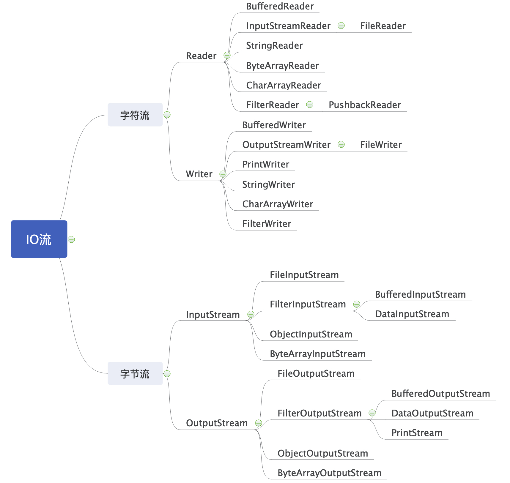

#  开发人员遇到的问题与建议


本文是根据笔者多年观察一线程序员在实际工作中遇到的问题结合自身的经验提出的一些建议。

类似编码规范、版本控制等属于部门岗位相关要求，本文中不会涉及。

文中内容主要是开发人员在平时工作中常常疏漏的地方与建议。

目前[**文档**](https://github.com/BeanZero/dev-questions)内容仍在不断完善中。


* [开发人员遇到的问题与建议](#%E5%BC%80%E5%8F%91%E4%BA%BA%E5%91%98%E9%81%87%E5%88%B0%E7%9A%84%E9%97%AE%E9%A2%98%E4%B8%8E%E5%BB%BA%E8%AE%AE)
  * [开发篇](#%E5%BC%80%E5%8F%91%E7%AF%87)
    * [池化技术](#%E6%B1%A0%E5%8C%96%E6%8A%80%E6%9C%AF)
      * [线程池](#%E7%BA%BF%E7%A8%8B%E6%B1%A0)
      * [连接池](#%E8%BF%9E%E6%8E%A5%E6%B1%A0)
      * [对象池](#%E5%AF%B9%E8%B1%A1%E6%B1%A0)
    * [Java IO](#java-io)
      * [Java IO流答疑](#java-io%E6%B5%81%E7%AD%94%E7%96%91)
      * [阻塞与非阻塞](#%E9%98%BB%E5%A1%9E%E4%B8%8E%E9%9D%9E%E9%98%BB%E5%A1%9E)
      * [同步与异步](#%E5%90%8C%E6%AD%A5%E4%B8%8E%E5%BC%82%E6%AD%A5)
      * [BIO/NIO/AIO](#bionioaio)
      * [Netty](#netty)
    * [线程安全](#%E7%BA%BF%E7%A8%8B%E5%AE%89%E5%85%A8)
      * [volatile](#volatile)
      * [Atomic类](#atomic%E7%B1%BB)
      * [synchronized](#synchronized)
      * [Lock](#lock)
      * [ThreadLocal](#threadlocal)
      * [java\.util\.concurrent](#javautilconcurrent)
    * [性能优化](#%E6%80%A7%E8%83%BD%E4%BC%98%E5%8C%96)
      * [复杂度](#%E5%A4%8D%E6%9D%82%E5%BA%A6)
      * [查询优化](#%E6%9F%A5%E8%AF%A2%E4%BC%98%E5%8C%96)
    * [分布式](#%E5%88%86%E5%B8%83%E5%BC%8F)
      * [负载均衡](#%E8%B4%9F%E8%BD%BD%E5%9D%87%E8%A1%A1)
      * [分布式锁](#%E5%88%86%E5%B8%83%E5%BC%8F%E9%94%81)
    * [中间件](#%E4%B8%AD%E9%97%B4%E4%BB%B6)
      * [Redis](#redis)
      * [Zookeeper](#zookeeper)
      * [MQ](#mq)
      * [Elastic Stack](#elastic-stack)
  * [运维篇](#%E8%BF%90%E7%BB%B4%E7%AF%87)
    * [生产环境优化](#%E7%94%9F%E4%BA%A7%E7%8E%AF%E5%A2%83%E4%BC%98%E5%8C%96)
      * [Tomcat优化](#tomcat%E4%BC%98%E5%8C%96)
      * [JVM优化](#jvm%E4%BC%98%E5%8C%96)
    * [生产环境监控](#%E7%94%9F%E4%BA%A7%E7%8E%AF%E5%A2%83%E7%9B%91%E6%8E%A7)
      * [保存环境信息(堆栈、CPU、内存、IO等)](#%E4%BF%9D%E5%AD%98%E7%8E%AF%E5%A2%83%E4%BF%A1%E6%81%AF%E5%A0%86%E6%A0%88cpu%E5%86%85%E5%AD%98io%E7%AD%89)
    * [数据库](#%E6%95%B0%E6%8D%AE%E5%BA%93)
      * [MySQL](#mysql)
      * [Oracle](#oracle)
    * [JenkinsCI](#jenkinsci)
    * [Docker](#docker)
  * [工具篇](#%E5%B7%A5%E5%85%B7%E7%AF%87)
    * [TCPDUMP抓包](#tcpdump%E6%8A%93%E5%8C%85)
    * [Wireshark抓包](#wireshark%E6%8A%93%E5%8C%85)
    * [MAT内存分析工具](#mat%E5%86%85%E5%AD%98%E5%88%86%E6%9E%90%E5%B7%A5%E5%85%B7)


## 开发篇

### 池化技术

#### 线程池

如果你阅读过《阿里巴巴 Java 开发手册》又或者使用其提供的扫描插件就会知道，阿里建议直接创建线程而是通过线程池来管理线程，增加资源利用率。那么——

1. 线程池有哪些常用属性？

   > - corePoolSize：表示核心线程数。
   > - maximumPoolSize：表示最大线程数。
   > - workQueue：工作队列，如果当前线程数超过corePoolSize，那么往该队列中插入任务。
   > - keepAliveTime：空闲时间，如果线程数超出 corePoolSize，并且有些线程的空闲时间超过了这个值，会执行关闭这些线程的操作
   > - rejectedExecutionHandler：拒绝策略，用于处理当线程池不能执行此任务时的情况，默认有抛出 RejectedExecutionException 异常、忽略任务、使用提交任务的线程来执行此任务和将队列中等待最久的任务删除，然后提交此任务这四种策略，默认为抛出异常。

2. 线程池如何创建线程呢？

   > - 如果当前线程数少于 corePoolSize，那么提交任务的时候创建一个新的线程，并由这个线程执行这个任务。
   > - 如果当前线程数已经达到 corePoolSize，那么将提交的任务添加到队列中，等待线程池中的线程去队列中取任务。
   > - 如果队列已满，那么创建新的线程来执行任务，需要保证池中的线程数不会超过 maximumPoolSize，如果此时线程数超过了 maximumPoolSize，那么执行拒绝策略。

3. 尽量重用线程池，而不是每次创建

   ```java
   /**
    * 使用一个静态字段来存放线程池的引用，返回线程池的代码直接返回这个静态字段。
    */
   public class ThreadPoolHelper {
   
       private static final int CORE_THREAD_SIZE = 5;
   
       private static final int MAX_THREAD_SIZE = 10;
   
       private static final String THREAD_NAME = "THREAD_POOL_";
   
       private static ExecutorService service;
   
       static {
           service = new ThreadPoolExecutor(
                   CORE_THREAD_SIZE, MAX_THREAD_SIZE, 0L, TimeUnit.MILLISECONDS,
                   new LinkedBlockingQueue<>(1024),
                   new ThreadFactoryBuilder().setNameFormat(THREAD_NAME + "%d").build(),
                   new ThreadPoolExecutor.AbortPolicy());
       }
   
       public static ExecutorService getThreadPool() {
           return service;
       }
   }
   ```

4. 连接池属性设置多大合适？

   > 需要根据实际的**并发(TPS)情况**、**CPU核心数**来评估线程池的参数，包括核心线程数、最大线程数、线程回收策略、工作队列的类型，以及拒绝策略，一般而言需要设置有界的工作队列。
   >
   > - 对于执行耗时较长、数量较少的任务，或许要考虑更多的线程数，而不需要太大的队列。
   > - 而对于吞吐量较大的计算型任务，线程数量不宜过多，可以是 CPU 核数或核数 *2（理由是，线程一定调度到某个 CPU 进行执行，如果任务本身是 CPU 绑定的任务，那么过多的线程只会增加线程切换的开销，并不能提升吞吐量），但可能需要较长的队列来做缓冲。
   > - 综合考虑线程等待时间跟线程CPU时间。线程等待时间所占比例越高，需要越多线程。线程CPU时间所占比例越高，需要越少线程。
   >
   > <font color=red>`注1：例如LinkedBlockingQueue虽为有界队列，但是如果没有设置大小，缺省为Integer.MAX_VALUE这样就跟无界队列没有区别了。`</font>
   >
   > <font color=red>`注2：多线程的使用也带来线程上下文切换的开销，Redis是单线程但是可以处理高达10万每秒的请求`</font>


#### 连接池

连接池用于对外提供获取连接、归还连接的接口给客户端使用，并暴露**最小空闲连接数**、**最大连接数**等可配置参数，在内部则实现连接建立、连接心跳保持、连接管理、空闲连接回收、连接可用性检测等功能。

常用的连接池有**数据库连接池**、**Redis连接池**、**HTTP连接池**等等

1. Tomcat默认数据库连接池变化

   > Tomcat8之前缺省连接池使用的是DBCP，而在Tomcat8及之后的版本中连接池则换成了DBCP2。二者在参数上有所修改。例如**maxActive**已改成**maxTotal**，需要特别留意！
   >
   > 
   >
   > Tomcat7.X中的conf/context.xml配置——
   >
   > ```xml
   > <Resource name="xxxxx" auth="Container"
   >               type="javax.sql.DataSource"
   >               driverClassName="oracle.jdbc.OracleDriver"
   >               url="jdbc:oracle:thin:@xxx.xxx.xx.xxx:1521:orcl"
   >               username="xxxxxxx"
   >               password="xxxxxxx"
   >               maxActive="200"
   >               maxIdle="60"
   >               maxWait="-1"
   >               testOnBorrow="true"
   >               validationQuery="select 1 from dual"/>
   > ```
   >
   > Tomcat8.5.X中的conf/context.xml配置——
   >
   > ```xml
   > <Resource name="xxxxx" auth="Container"
   >               type="javax.sql.DataSource"
   >               driverClassName="oracle.jdbc.OracleDriver"
   >               url="jdbc:oracle:thin:@xxx.xxx.xx.xxx:1521:orcl"
   >               username="xxxxxxx"
   >               password="xxxxxxx"
   >               initialSize="20"
   >               minIdle="20"
   >               maxIdle="20"
   >               maxTotal="30"
   >               maxWaitMillis="10000"
   >               testWhileIdle="true"
   >               testOnBorrow="true"
   >               validationQuery="select 1 from dual"/>
   > ```
   >
   > 参考资料:[common-dbcp2数据库连接池参数说明](https://www.iteye.com/blog/bsr1983-2092467)

2. 连接池是不是越大越好？

   > 显然连接池并非越大越好。如果设置得太大，不仅仅是客户端需要耗费过多的资源维护连接，更重要的是由于服务端对应的是多个客户端，每一个客户端都保持大量的连接，会给服务端带来更大的压力。这个压力又不仅仅是内存压力，可以想一下如果服务端的网络模型是一个 TCP 连接一个线程，那么几千个连接意味着几千个线程，如此多的线程会造成大量的线程切换开销。

3. 如何确定合适的连接池最大连接数？

   > 建议使用 JMeter, LoadRunner等测试工具，根据生产环境实际的使用情况的峰值(建议峰值*1.25)进行压测，配合JConsole、Jvisualvm监控连接池数与等待线程的变化。在保持正常吞吐量不变的情况下连接数尽量越少越好，其次就是需要监控和报警机制，根据容量规划及时调整参数配置。


#### 对象池

1. 什么是对象池? 为什么要使用对象池？

   > 创建对象的性能开支远比单纯调用方法要高得多。为了最大限度的节省服务器资源提高效率复用对象是常见的解决方案。

2. 对象池有哪些具体实现

   > Apache的common-pool则为我们提供是使用对象池的基础。在很多我们熟悉的JAR包中都是使用对象池来实现，例如：dbcp、dbcp2，jedis等等
   >
   > `注：tomcat8.5默认的dbcp2是自身提供的，并非common-dbcp2.jar的请留意`

3. 对象池参数实例

   > 1. 实现PooledObjectFactory接口或者继承BasePooledObjectFactory
   >
   >    ```java
   >    /**
   >     * GenericPooledObjectFactory 仍然是一个通用型的PooledObjectFactory
   >     * 通过泛型抽象参数类型
   >     */
   >    public class GenericPooledObjectFactory<T> extends BasePooledObjectFactory<T> {
   >    
   >        private volatile Class clazz;
   >    
   >        public GenericPooledObjectFactory(Class<T> clazz) {
   >            this.clazz = clazz;
   >        }
   >    
   >        @Override
   >        public T create() {
   >            try {
   >                return (T) clazz.newInstance();
   >            } catch (Exception e) {
   >                throw new RuntimeException(e);
   >            }
   >        }
   >    
   >        @Override
   >        public PooledObject<T> wrap(T obj) {
   >            return new DefaultPooledObject<>(obj);
   >        }
   >        
   >    }
   >    ```
   >
   > 2. 例如实现一个RestTemplate的线程池，继承GenericPooledObjectFactory，并重写了create方法
   >
   >    ```java
   >    /**
   >     * 继承GenericPooledObjectFactory，并重写了create方法
   >     */
   >    public class RestTemplatePooledFactory 
   >       extends GenericPooledObjectFactory<RestTemplate> {
   >    
   >        public RestTemplatePooledFactory() {
   >            super(RestTemplate.class);
   >        }
   >    
   >        @Override
   >        public RestTemplate create() {
   >            SimpleClientHttpRequestFactory requestFactory 
   >              = new SimpleClientHttpRequestFactory();
   >            requestFactory.setReadTimeout(60000);
   >            requestFactory.setConnectTimeout(10000);
   >            return new RestTemplate(requestFactory);
   >        }
   >    }
   >    ```
   >
   > 3. 可以创建一个通用对象池工具类方便调用
   >
   >    ```java
   >    /**
   >     * 通用对象池工具类
   >     *
   >     * 获取对象请使用{@link GenericPooledObjectUtils#borrowObject(Class)}
   >     * 归还对象请使用{@link GenericPooledObjectUtils#returnObject(Object)}
   >     *
   >     * 两个方法必须成对使用，用法如下：
   >     *
   >     * try {
   >     *     // ...
   >     *     GenericObjectPoolUtils.borrowObject(obj);
   >     *     // ...
   >     * } finally {
   >     *     // ...
   >     *     GenericObjectPoolUtils.returnObject(obj)
   >     * }
   >     *
   >     */
   >    public class GenericPooledObjectUtils {
   >        private static final Logger logger = Logger.getLogger(GenericPooledObjectUtils.class);
   >        private final static Map<Class, ObjectPool> CACHE = new ConcurrentHashMap<>(32);
   >    
   >    
   >        /**
   >         * 获取对象池
   >         *
   >         * @param clazz 对象类型
   >         * @param <T>   对象类型
   >         * @return 对象池
   >         */
   >        private static <T> ObjectPool<T> getObjectPool(Class<T> clazz) {
   >            if (CACHE.containsKey(clazz)) {
   >                return CACHE.get(clazz);
   >            }
   >            synchronized (clazz) {
   >                if (!CACHE.containsKey(clazz)) {
   >                    GenericObjectPool<T> pool = new GenericObjectPool<T>(getPooledObjectFactory(clazz));
   >                    pool.setConfig(getGenericObjectPoolConfig());
   >                    CACHE.put(clazz, pool);
   >                    return pool;
   >                }
   >                return CACHE.get(clazz);
   >            }
   >    
   >        }
   >    
   >        /**
   >         * 获取对象池配置信息
   >         *
   >         * @return 对象池配置信息
   >         */
   >        private static GenericObjectPoolConfig getGenericObjectPoolConfig() {
   >            GenericObjectPoolConfig config = new GenericObjectPoolConfig();
   >            config.setMinIdle(20);
   >            config.setMinIdle(50);
   >            config.setMaxTotal(200);
   >            config.setMaxWaitMillis(30 * 1000);
   >            config.setTestOnBorrow(true);
   >            config.setTestWhileIdle(true);
   >            config.setTestOnReturn(true);
   >            return config;
   >        }
   >    
   >        /**
   >         * 获取对象工厂
   >         *
   >         * @param clazz 对象类型
   >         * @param <T>   对象类型
   >         * @return 对象工厂
   >         */
   >        private static <T> PooledObjectFactory<T> getPooledObjectFactory(Class<T> clazz) {
   >            if (clazz == null) {
   >                return null;
   >            }
   >            if (clazz == RestTemplate.class) {
   >                return (PooledObjectFactory<T>) new RestTemplatePooledFactory();
   >            } else {
   >                return new GenericPooledObjectFactory<>(clazz);
   >            }
   >        }
   >    
   >        /**
   >         * 获取对象，注意：传入的参数类型必须有无参构造函数¨
   >         *
   >         * @param clazz 对象类型
   >         * @param <T>   对象类型
   >         * @return 对象实体
   >         */
   >        public static <T> T borrowObject(Class<T> clazz) {
   >            // 类型为空，返回空对象
   >            if (clazz == null) {
   >                return null;
   >            }
   >    
   >            // 类型不为空，获取对象
   >            ObjectPool<T> pool = getObjectPool(clazz);
   >            try {
   >                return pool.borrowObject();
   >            } catch (Exception e) {
   >                logger.error(e.getMessage(), e);
   >            }
   >    
   >            return null;
   >        }
   >    
   >        /**
   >         * 归还对象
   >         *
   >         * @param t   要归还的对象
   >         * @param <T> 对象类型
   >         * @return true: 归还成功，false: 归还失败
   >         */
   >        public static <T> boolean returnObject(T t) {
   >            // 对象为空不用归还
   >            if (t == null) {
   >                return true;
   >            }
   >            // 归还对象
   >            try {
   >                // 获取对象池，没有此对象的对象池不用归还
   >                ObjectPool<T> pool = (ObjectPool<T>) getObjectPool(t.getClass());
   >                if (pool == null) {
   >                    return true;
   >                }
   >                pool.returnObject(t);
   >                return true;
   >            } catch (Exception e) {
   >                logger.error(e.getMessage(), e);
   >            }
   >            return false;
   >        }
   >    
   >    }
   >    ```


### Java IO

#### Java IO流答疑

1. JAVA IO流常用类有哪些？什么是输入与输出？

   

   > 上图中可以看出，JAVA IO主要分为**字节流(InputStream、OutputStream)**与**字符流(Reader、Writer)**，根据需要选择具体的实现。
   >
   > **输入**与**输出**是相对概念，而**参照物为程序(内存)**。从磁盘、网络IO等媒介读取到内存叫输入，反之从内存往磁盘、网络IO等写叫输出。一言以蔽之**读取数据是输入流，写入数据则是输出流**。

2. 字节流跟字符流的区别？

   > **字节流**：字节流适合所有类型文件的数据传输，例如常见的文本、音频、视频、图片等等。字节不需要编码、解码。
   >
   > **字符流**：只能针对文本实现输入和输出，字符流是在字节流的基础上融入了编码，可以更加方便的对文本进行操作。字节与字符之间转换时需要编码、解码。

3. 一次性读取文件的弊端

   > 笔者曾经在review同事代码时就发现类似下文中的写法
   >
   > ```java
   > // 错误示范：一次性读取文件
   > byte[] bytes = new bytes[is.available()];
   > 
   > // 错误示范：法获取文件大小，就设置一个很大的bytes
   > byte[] bytes = new bytes[1024 * 1024 * 100];
   > ```
   >
   > <font color=red>结果就是UAT环境造成内存溢出，特别并发调用时容易造成OOM</font>

4. 如何关闭输入输出流？

   > - try-finally方式关闭，按照对象声明的**逆序**关闭流
   >
   > ```java
   > finally {
   >   if (input != null) {
   >     try {
   >       input.close();
   >     } catch (IOException e) {
   >     }
   >   }
   >   if (output != null) {
   >     try {
   >       output.close();
   >     } catch (IOException e) {
   >     }
   >   }
   > }
   > ```
   >
   > - 使用工具类IOUtils.closeQuietly(xxx)关闭流
   >
   > ```java
   > finally {
   >   IOUtils.closeQuietly(output);
   >   IOUtils.closeQuietly(input);
   > }
   > ```
   >
   > - 使用JDK8的语法糖
   >
   > ```java
   > /**
   >  * JDK8语法糖 try()
   >  * 注意try后面是小括号()
   >  * 会按照对象声明的逆序关闭流，类似自动try-finally
   >  */
   > try (
   >   ByteArrayOutputStream out = new ByteArrayOutputStream()；
   > ) {
   >   // code
   > } finally {
   > }
   > ```
   >
   > `注：try()中可以声明多个流对象，无论运行是否出错，最终都会按照声明的逆顺序依次关闭`

5. 字符编码问题

   > 编码表示从字符到二进制，解码表示从二进制到字符
   >
   > - 编码：String ----> byte[]
   > - 解码：byte[] ----> String
   >
   > 乱码产生的原因如下：
   >
   > - 编码和解码规则不一致
   >
   >   ```java
   >   // 编码
   >   byte[] b1 = "测试乱码问题！".getBytes("GBK");
   >   
   >   // 解码：编码和解码规则不一致，乱码
   >   System.out.println(new String(b1,"UTF-8"));
   >   ```
   >
   > - 字符编码不支持某种语言
   >
   >   ```java
   >   // 编码：ISO8859-1不支持中文
   >   byte[] b1 = "测试乱码问题！".getBytes("ISO8859-1");
   >   
   >   // 解码：编码和解码一致，但是ISO8859-1不支持中文，乱码
   >   System.out.println(new String(b1,"ISO8859-1"));
   >   ```
   >

6. 常用Java IO流简介

   > - **java.io.File**：用于表示文件或目录，只能获取类似名称、大小等信息，**不能用于文件内容的访问**。
   >
   >   ```java
   >   // 获取文件
   >   File file = new File("~/document/1.txt");
   >   
   >   // 判断文件或目录是否存在
   >   if (!file.exists()) {
   >       // 创建单一目录
   >       file.mkdir();
   >   } else {
   >       // 删除文件或目录
   >       file.delete();
   >   }
   >   
   >   // ******************************* 华丽的分隔符 *******************************
   >   
   >   // 判断是否为一个目录
   >   System.out.println(file.isDirectory());
   >   // 判断是否为一个文件
   >   System.out.println(file.isFile());
   >   // 判断是否为一个隐藏文件
   >   System.out.println(file.isHidden());
   >   // 相当于file.toString()的内容
   >   System.out.println(file);
   >   // 得到文件或目录的绝对路径字符串
   >   System.out.println(file.getAbsolutePath());
   >   // 得到最后一个文件或最后一级目录的名字
   >   System.out.println(file.getName());
   >   // 得到文件或目录的全部路径字符串
   >   System.out.println(file.getPath());
   >   // 得到最后一个文件或最后一级目录的父目录名字符串
   >   System.out.println(file.getParent());
   >   // 得到最后一个文件或最后一级目录的父目录名，再将父目录名转为绝对路径字符串
   >   System.out.println(file.getParentFile().getAbsolutePath());
   >   // 文件最后被修改的时间
   >   System.out.println(new SimpleDateFormat("yyyy-MM-dd E HH:mm:ss").format(new Date(file.lastModified())));
   >   ```
   >
   > - **java.io.RandomAccessFile**：可以对文件内容进行访问，既可以对文件内容进行读取操作，也可以写入新的内容，并且RandomAccessFile支持随机访问文件，即访问文件内容的任意位置， 常应用于**断点续传**。
   >
   >   ```java
   >   /**
   >    * 访问文件有两种可选模式：读写模式（“rw”） 只读模式（“r”）
   >    * 访问文件时指针在文件内容的起始位置，即 pointer = 0
   >    */
   >   RandomAccessFile raf = new RandomAccessFile(file,"rw");
   >   
   >   /**
   >    * 写入操作
   >    * 只写一个字节，即后8位，同时指针指向下一位置准备再次写入
   >    * 因此一个整形其实需要写4次，每次写8位
   >    */
   >   raf.write(int b);
   >   
   >   /**
   >    * 读取操作(读一个字节)
   >    */
   >   int b = raf.read();
   >   
   >   // ******************************* 华丽的分隔符 *******************************
   >   
   >   // 指定访问文件的方式
   >   RandomAccessFile raf = new RandomAccessFile("~/document/1.txt","rw");
   >   // 查看打开文件时的指针位置
   >   System.out.println(raf.getFilePointer());
   >   
   >   // ******************************* 华丽的分隔符 *******************************
   >   
   >   // 示例：如何写入一个int类型
   >   int i = 0x7fffffff;
   >   
   >   // 方案一
   >   raf.write(i >>> 24); // 高8位
   >   raf.write(i >>> 16);
   >   raf.write(i >>> 8);
   >   raf.write(i); // 默认后8位
   >   
   >   //方案二(提供直接写入int的方法)
   >   raf.writeInt(i);
   >   /**
   >    * writeInt方法的源码，如下所示
   >    */
   >   public final void writeInt(int v) throws IOException {
   >       write((v >>> 24) & 0xFF);
   >       write((v >>> 16) & 0xFF);
   >       write((v >>>  8) & 0xFF);
   >       write((v >>>  0) & 0xFF);
   >       //written += 4;
   >   }
   >   
   >   // ******************************* 华丽的分隔符 *******************************
   >   
   >   // 示例：写一个中文
   >   String s = "中";
   >   byte[] gbk = s.getBytes("gbk");
   >   raf.write(gbk);
   >   /*
   >    * 查看当前文件长度
   >    * 中文占2个字节
   >    */
   >   System.out.println(raf.length());
   >   
   >   // ******************************* 华丽的分隔符 *******************************
   >   
   >   /*
   >    * 读取操作
   >    * 执行前必须把文件指针移到头部
   >    * 一次性读取需要移动到起始位置，即0
   >    */
   >   raf.seek(0);
   >   
   >   /*
   >    * 一次性读取
   >    * 开辟一个字节数组，长度为raf.length()，返回值是long型
   >    * 把文件中的内容全部读取到该字节数组中
   >    */
   >   byte[] buf = new byte[(int)raf.length()];
   >   raf.read(buf);
   >   System.out.println(Arrays.toString(buf));
   >   
   >   // 转换成字符串输出
   >   String s1 = new String(buf);
   >   System.out.println(s1);
   >   
   >   // 以十六进制输出
   >   for (byte b : buf) {
   >       System.out.print(Integer.toHexString(b&0xff)+" ");
   >   }
   >   
   >   // 及时关闭
   >   raf.close();
   >   ```
   >
   >   <font color=red>`注：通过java.io.RandomAccessFile读写文件，使用完成之后请务必及时关闭。`</font>
   >
   > - **字节流**：字节流适合所有类型文件的数据传输，例如常见的文本、音频、视频、图片等等。字节不需要编码、解码。
   >
   >   ```java
   >   /**
   >    * 字节输入流读取文件中的数据(字节数组)
   >    *
   >    * @param file
   >    * @throws IOException
   >    */
   >   public static void readFile(String file) throws IOException {
   >       try (InputStream is = new FileInputStream(file)) {
   >           byte[] arr = new byte[2048];
   >           int num;
   >           while ((num = is.read(arr)) != -1) {
   >               System.out.println(new String(arr, 0, num));
   >           }
   >       }
   >   }
   >   
   >   /**
   >    * 字节输出流向文件中写入数据
   >    *
   >    * @param file
   >    * @param writer
   >    * @throws IOException
   >    */
   >   public static void writeFile(String file, String writer) throws IOException {
   >       try (OutputStream os = new FileOutputStream(file)) {
   >           os.write(writer.getBytes());
   >       }
   >   }
   >   
   >   /**
   >    * 文件拷贝
   >    *
   >    * @param fileIn
   >    * @param fileOut
   >    * @throws IOException
   >    */
   >   public static void copyFile(String fileIn, String fileOut) throws IOException {
   >       try (InputStream is = new FileInputStream(fileIn);
   >            OutputStream os = new FileOutputStream(fileOut)) {
   >           byte[] arr = new byte[2048];
   >           int num;
   >           while ((num = is.read(arr)) != -1) {
   >               os.write(arr, 0, num);
   >           }
   >       }
   >   }
   >   
   >   /**
   >    * 文件拷贝(字节缓冲流)
   >    *
   >    * @param fileIn
   >    * @param fileOut
   >    * @throws IOException
   >    */
   >   public static void copyFileBuffered(String fileIn, String fileOut) throws IOException {
   >       try (InputStream is = new BufferedInputStream(new FileInputStream(fileIn));
   >            OutputStream os = new BufferedOutputStream(new FileOutputStream(fileOut))) {
   >           byte[] arr = new byte[2048];
   >           int num;
   >           while ((num = is.read(arr)) != -1) {
   >               os.write(arr, 0, num);
   >           }
   >       }
   >   }
   >   ```
   >
   > - **字符流**：只能针对文本实现输入和输出，字符流是在字节流的基础上融入了编码，可以更加方便的对文本进行操作。字节与字符之间转换时需要编码、解码。
   >
   >   ```java
   >   /**
   >    * 字符流读取数据
   >    *
   >    * @param file
   >    * @throws IOException
   >    */
   >   public static void fileReader(String file) throws IOException {
   >       try (FileReader fr = new FileReader(file)) {
   >           char[] arr = new char[1024];
   >           int num;
   >           while ((num = fr.read(arr)) != 1) {
   >               System.out.print(new String(arr, 0, num));
   >           }
   >       }
   >   }
   >   
   >   /**
   >    * 缓冲输入流实现对文件的读取
   >    *
   >    * @param file
   >    * @throws IOException
   >    */
   >   public static void bufferedReader(String file) throws IOException {
   >       try (FileReader fr = new FileReader(file);
   >            BufferedReader br = new BufferedReader(fr)) {
   >           String line;
   >           while ((line = br.readLine()) != null) {
   >               System.out.println(line);
   >           }
   >       }
   >   }
   >   
   >   
   >   /**
   >    * 字符流写入数据
   >    *
   >    * @param file
   >    * @param writer
   >    * @throws IOException
   >    */
   >   public static void fileWriter(String file, String writer) throws IOException {
   >       try (FileWriter fw = new FileWriter(file, true)) {
   >           /**
   >            * 使用输出流对象向文件中写入数据
   >            * 其实数据是写入到了输出流对象的内部数组中
   >            * 该数组是一个字节数组，通过底层查询编码将最终的结果写入文件
   >            */
   >           fw.write(writer);
   >           // 把输出流对象内部缓冲的数据刷新到文件中
   >           fw.flush();
   >       }
   >   }
   >   
   >   /**
   >    * 缓冲输出流实现对文件的写入
   >    *
   >    * @param file
   >    * @param writer
   >    * @throws IOException
   >    */
   >   public static void bufferedWriter(String file, String writer) throws IOException {
   >       try (FileWriter fw = new FileWriter(file, true);
   >            BufferedWriter bw = new BufferedWriter(fw)) {
   >           bw.write(writer);
   >       }
   >   }
   >   
   >   /**
   >    * 文件拷贝
   >    *
   >    * @param fileIn
   >    * @param fileOut
   >    * @throws IOException
   >    */
   >   public static void copyFile(String fileIn, String fileOut) throws IOException {
   >       try (FileReader fr = new FileReader(fileIn);
   >            FileWriter fw = new FileWriter(fileOut)) {
   >           char[] arr = new char[1024];
   >           int num;
   >           while ((num = fr.read(arr)) != -1) {
   >               fw.write(arr, 0, num);
   >               fw.flush();
   >           }
   >       }
   >   }
   >   
   >   /**
   >    * 缓冲流文件拷贝
   >    *
   >    * @param fileIn
   >    * @param fileOut
   >    * @throws IOException
   >    */
   >   public static void copyFileBuffered(String fileIn, String fileOut) throws IOException {
   >       try (BufferedReader br = new BufferedReader(new FileReader(fileIn));
   >            BufferedWriter bw = new BufferedWriter(new FileWriter(fileOut))) {
   >           String line;
   >           while ((line = br.readLine()) != null) {
   >               bw.write(line);
   >               bw.newLine();
   >           }
   >       }
   >   }
   >   ```
   >
   > - **对象序列化**：将Object类型的对象转换成byte序列，简单来讲就是要存储对象，将对象写入文件。
   >
   > - **对象反序列化**：将byte序列转换成Object类型的对象，简单来讲就是从文件中读取对象。
   >
   >   ```java
   >   /**
   >    * 创建一个用于演示对象{序列号}与{反序列化}的类
   >    */
   >   public class AttachmentCache implements Serializable {
   >   
   >       private static final long serialVersionUID = 1L;
   >   
   >       private String key;
   >   
   >       /**
   >        * transient 表示无需序列号
   >        * 但是可以通过readObject跟writeObject手动实现序列化与反序列化
   >        */
   >       private transient String value;
   >   
   >       public AttachmentCache() {
   >       }
   >   
   >       public AttachmentCache(String key, String value) {
   >           this.key = key;
   >           this.value = value;
   >       }
   >   
   >       private void readObject(ObjectInputStream ois) throws IOException, ClassNotFoundException {
   >           ois.defaultReadObject();
   >           this.value = (String) ois.readObject();
   >       }
   >   
   >       private void writeObject(ObjectOutputStream oos) throws IOException {
   >           oos.defaultWriteObject();
   >           oos.writeObject(value);
   >       }
   >   
   >       public String getKey() {
   >           return key;
   >       }
   >   
   >       public void setKey(String key) {
   >           this.key = key;
   >       }
   >   
   >       public String getValue() {
   >           return value;
   >       }
   >   
   >       public void setValue(String value) {
   >           this.value = value;
   >       }
   >   }
   >   ```
   >
   >   ```java
   >   /**
   >    * 对象(AttachmentCache)序列化
   >    *
   >    * @param file
   >    * @param key
   >    * @param value
   >    * @throws IOException
   >    */
   >   public static void serialize(String file, String key, String value) throws IOException {
   >       try (ObjectOutputStream oos = new ObjectOutputStream(new FileOutputStream(file))) {
   >           AttachmentCache cache = new AttachmentCache(key, value);
   >           oos.writeObject(cache);
   >       }
   >   }
   >   
   >   /**
   >    * 对象(AttachmentCache)反序列化
   >    *
   >    * @param file
   >    * @throws IOException
   >    * @throws ClassNotFoundException
   >    */
   >   public static void deserialize(String file) throws IOException, ClassNotFoundException {
   >       try (ObjectInputStream oos = new ObjectInputStream(new FileInputStream(file))) {
   >           AttachmentCache cache = (AttachmentCache) oos.readObject();
   >           System.out.println(cache.key + ", " + cache.getValue());
   >       }
   >   }
   >   ```
   >

#### 阻塞与非阻塞

1. 什么是阻塞与非阻塞

   > **应用程序**去发起IO请求之后，**操作系统(系统内核)**接受请求(例如：读写一个文件)时——
   >
   > - 如果文件不可供读写，则**应用程序**就进入**等待**状态，直到文件可供读写为止我们称之为**阻塞**。
   > - 如果文件不可供读写，则**应用程序**并非等待而是会**立刻返回**，通过其他方式来判断具体操作是否成功（例如：轮训），则称之为**非阻塞**。

#### 同步与异步

1. 什么是同步与异步

   > 待更新

#### BIO/NIO/AIO

1. BIO NIO AIO基础知识

   > 待更新

2. 为什么用NIO？

   > 待更新

#### Netty

1. Netty是什么？

   > 待更新

2. Netty实例

   > 待更新

### 线程安全

#### volatile

1. 什么是内存可见性？

   > 待更新

2. volatile介绍

   > 待更新

#### Atomic类

1. 什么是原子操作？

   > 待更新

2. 案例

   > 待更新

#### synchronized

1. 单例中的synchronized

   > 待更新

2. 谨慎使用synchronized

   > 待更新

#### Lock

1. java中的锁介绍

   > 待更新

2. lock常用案例

   > 待更新

#### ThreadLocal

1. 什么是ThreadLocal？

   > ThreadLocal类提供线程局部变量。这种变量在多线程中访问（通过其{@code get}或{@code set}方法）每一个线程有自己的、独立初始化的变量的副本。不同的线程之间的变量不会相互干扰，该变量作用于线程的生命周期中。
   >
   
2. 为什么使用ThreadLocal？

   > 用于关联线程和线程的上下文，目的是为了减少同一个线程内多个方法调用的间一些公共变量的传递复杂度。通常修饰为“**private static final**”，如下所示：
   >
   > ```java
   > private static final ThreadLocal<T> threadLocal = new ThreadLocal<T>();
   > ```

3. 使用ThreadLocal要注意什么？

   > 线程复用导致信息错乱——
   >
   > 例如Tomcat的工作线程是基于线程池的，线程是复用的。那么很可能本次次从 ThreadLocal 获取的值是之前其他请求遗留的值，造成数据污染。
   >
   > 因此使用类似 ThreadLocal 工具来存放一些数据时，需要特别注意在代码运行完后，**显式地去清空设置的数据**。
   >
   > ```java
   > try {
   >     //...
   > } finally {
   >     //显示移除数据
   >     threadLocal.remove();
   > }
   > 
   > ```

4. 自定义ThreadLocal工具类

   > ThreadLocal工具类
   >
   > ```java
   > /**
   >  * @author BeanZero
   >  * @date 2019-07-10
   >  */
   > public class ThreadLocalUtil {
   > 
   >     private static final ThreadLocal<Map<String, Object>> threadLocal = ThreadLocal.withInitial(() -> new HashMap(4));
   > 
   >     public static Map<String, Object> get() {
   >         return threadLocal.get();
   >     }
   > 
   >     public static <T> T get(String key) {
   >         Map map = threadLocal.get();
   >         return (T) map.get(key);
   >     }
   > 
   >     public static void set(String key, Object value) {
   >         Map map = threadLocal.get();
   >         map.put(key, value);
   >     }
   > 
   >     public static void remove() {
   >         threadLocal.remove();
   >     }
   > 
   >     public static void remove(String key) {
   >         Map map = threadLocal.get();
   >         map.remove(key);
   >     }
   > 
   > }
   > ```
   >
   > ThreadLocal工具类使用演示
   >
   > ```java
   > try {
   >   ThreadLocalUtil.set("LOCK_KEY", "QUEUE_REPORT_" + queue.getObjid());
   >   ThreadLocalUtil.set("LOCK_VALUE", GenerateUtil.UUID());
   >   //后续调用的方法均可以根据ThreadLocalUtil.get("xxxxx")获取之前set的值。
   >   sendEmailService.send(queue);
   > }
   > finally {
   >   //一定要记得显示remove，特别是在线程复用的情况时。
   >   ThreadLocalUtil.remove();
   > }
   > ```

#### java.util.concurrent

1. 线程安全的集合

   > 待更新

2. concurrent一定安全吗？

   > 待更新

### 性能优化

#### 复杂度

1. 时间复杂度

   > 待更新
   
2. 空间复杂度

   > 待更新

#### 查询优化

1. 空间换时间

   > 待更新

2. 利用缓存

   > 待更新

3. Steam流

   > 待更新

### 分布式

#### 负载均衡

1. 常用负载均衡方案

   > 待更新

2. NGINX的使用

   > 待更新

#### 分布式锁

1. 为什么要分布式锁？

   > 目前越来越多的项目使用负载均衡，以往传统单体应用单机部署的情况下使用的JAVA并发处理资源竞争方式（ReentrantLcok或synchronized等）在集群部署中已经无法保证资源的安全访问。需要考虑以下情况——
   >
   > - 允许多个客户端操作共享资源：对共享资源的操作一定是幂等性操作，无论你操作多少次都不会出现不同结果。在这里使用锁，无外乎就是为了避免重复操作共享资源从而提高效率。
   > - 只允许一个客户端操作共享资源：这种情况下，对共享资源的操作一般是非幂等性操作。在这种情况下，如果出现多个客户端操作共享资源，就可能意味着数据不一致，数据丢失。

2. 如何实现分布式锁？

   > 实现分布式锁一般基于**Zookeeper**或者**Redis**，前者**可靠性高**而后者**效率高**。
   >
   > 如果并发量不大追求可靠性选择Zookeeper，反之选择Redis。示例如下：
   >
   > - 实现分布式锁接口：因为分布式锁的实现可以是多种方式，建议抽象一个接口。
   >
   > ```java
   > /**
   >  * @author BeanZero
   >  * @date 2019-07-19
   >  * 
   >  * 分布式锁：因为分布式锁的实现可以是多种方式，建议抽象一个接口
   >  */
   > public interface DistributedLock {
   > 
   >     /**
   >      * 获取锁
   >      *
   >      * @param key
   >      * @param value
   >      * @return
   >      */
   >     public boolean tryLock(String key, String value);
   > 
   >     /**
   >      * 释放锁
   >      *
   >      * @param key
   >      * @param value
   >      * @return
   >      */
   >     public boolean releaseLock(String key, String value);
   > 
   >     /**
   >      * 获取值
   >      *
   >      * @param key
   >      * @return
   >      */
   >     public String getValue(String key);
   > 
   >     /**
   >      * 获取过期时间
   >      *
   >      * @param key
   >      * @return
   >      */
   >     public long getExpire(String key);
   > 
   > }
   > ```
   > - Redis配置(application.yml)
   >
   > ```yaml
   >spring:
   >   redis:
   >     lettuce:
   >       pool:
   >         max-active: 100
   >         max-idle: 50
   >         min-idle: 30
   >         max-wait: 2000ms
   >     # 哨兵模式
   >     sentinel:
   >       master: mymaster
   >       nodes: ${ARGS_REDIS_NODES}
   >     # 集群模式
   > #    cluster:
   > #      nodes: ${ARGS_REDIS_NODES}
   >     password: ${ARGS_REDIS_PASSWORD}
   > 
   > 
   > # 分布式配置
   > distributed:
   >   lock:
   >     expire: 60000
   >     connection-timeout-ms: 15000
   >     session-timeout-ms: 60000
   > ```
   > 
   > - 实现DistributedLock接口
   >
   > ```java
   >/**
   >  * @author BeanZero
   >  * @date 2019-07-21
   >  *
   >  * 分布式锁：使用Redis实现
   >  */
   > @AutoConfigureAfter({RedisAutoConfiguration.class})
   > @ConditionalOnBean(RedisAutoConfiguration.class)
   > @Service
   > @Slf4j
   > public class RedisDistributedLock implements DistributedLock {
   > 
   >     private final static String OK = "OK";
   > 
   >     private static final String UNLOCK_LUA;
   > 
   >     /**
   >      * Lua脚本来释放锁
   >      */
   >     static {
   >         StringBuilder sb = new StringBuilder();
   >         sb.append("if redis.call('get', KEYS[1]) == ARGV[1] ");
   >         sb.append("then ");
   >         sb.append("    return redis.call('del', KEYS[1]) ");
   >         sb.append("else ");
   >         sb.append("    return 0 ");
   >         sb.append("end");
   >         UNLOCK_LUA = sb.toString();
   >     }
   > 
   >     /**
   >      * 缺省超时时间
   >      */
   >     @Value("${distributed.lock.expire}")
   >     private long expire;
   > 
   >     @Resource
   >     private StringRedisTemplate stringRedisTemplate;
   > 
   >     @Override
   >     public boolean tryLock(String key, String value) {
   >         return tryLock(key, value, TimeUnit.MILLISECONDS, expire);
   >     }
   > 
   >     @Override
   >     public boolean releaseLock(String key, String value) {
   >         try {
   >             return stringRedisTemplate.execute(
   >               (RedisCallback<Boolean>) connection -> connection.eval(
   >                     UNLOCK_LUA.getBytes(), ReturnType.BOOLEAN, 1,
   >                     key.getBytes(Charset.forName("UTF-8")),
   >                     value.getBytes(Charset.forName("UTF-8"))));
   >         } catch (Exception ex) {
   >             log.error("释放redis锁失败", ex);
   >         }
   >         return false;
   > 
   >     }
   > 
   >     @Override
   >     public String getValue(String key) {
   >         return null;
   >     }
   > 
   >     @Override
   >     public long getExpire(String key) {
   >         return 0;
   >     }
   > 
   >     /**
   >      * 获取锁
   >      *
   >      * @param key
   >      * @param value
   >      * @param timeUnit
   >      * @param time
   >      * @return
   >      */
   >     private boolean tryLock(String key, String value, 
   >                             TimeUnit timeUnit, long time) {
   >         try {
   >             return stringRedisTemplate.execute(
   >               (RedisCallback<Boolean>) connection -> connection.set(
   >                     key.getBytes(Charset.forName("UTF-8")),
   >                     value.getBytes(Charset.forName("UTF-8")),
   >                     Expiration.milliseconds(timeUnit.toMillis(time)),
   >                     RedisStringCommands.SetOption.SET_IF_ABSENT)
   >             );
   >         } catch (Exception ex) {
   >             log.error("获取redis锁失败", ex);
   >         }
   >         return false;
   >     }
   > 
   > }
   > ```
   > 
   > - 使用分布式锁
   >
   > ```java
   >boolean lock = distributedLock.tryLock(LOCK_NAME, GenerateUtil.UUID());
   >     try {
   >     if (!lock) {
   >         //log.info("警告:已存在分布式锁[{}]", LOCK_NAME);
   >         return;
   >     }
   >     // 获取锁成功之后的代码...
   > } finally {
   >     if (lock) {
   >         distributedLock.releaseLock(LOCK_NAME, lockValue);
   >     }
   > }
   > ```
   > 
   > <font color=red>`警告：redis加解锁机制有一个无法避免的硬伤，就是过期时间如何设置。如果客户端在操作共享资源的过程中，因为长期阻塞的原因，导致锁过期，那么接下来访问共享资源就不安全。需要添加补偿手段增，例如新增守护线程监控过期时间，再超时之前补给。`</font>


### 中间件

#### Redis

>  待更新

#### Zookeeper

> 待更新

#### MQ

> 待更新

#### Elastic Stack

> 待更新


## 运维篇

### 生产环境优化

#### Tomcat优化

1. tomcat服务需要根据生产环境实际的并发数量进行调整，从而到达一个较为合理的状态能够长期稳定的运行，提高单节点的可用性。

   > 针对tomcat自身优化主要是提升**connector连接器**的工作能力。在Tomcat8之前默认使用的是bio的连接方式，而在Tomcat8之后则改成默认为nio连接。
   >
   > 打开文件$TOMCAT_HOME/conf/server.xml，默认Connector配置如下所示——
   >
   > ```xml
   > <Connector port="8080" protocol="HTTP/1.1" connectionTimeout="20000" redirectPort="443" />
   > ```
   >
   > 方案一：使用Http11NioProtocol or Http11Nio2Protocol
   >
   > ```xml
   > <Connector port="8080" protocol="org.apache.coyote.http11.Http11NioProtocol"
   >              maxHttpHeaderSize="8192"
   >              maxThreads="500"
   >              minSpareThreads="50"
   >              maxSpareThreads="200"
   >              acceptCount="200"
   >              URIEncoding="utf-8"
   >              maxPostSize="-1"
   >              connectionTimeout="30000"
   >              redirectPort="443"
   >              compression="on"
   >              compressionMinSize="2048"
   >              noCompressionUserAgents="gozilla, traviata"
   >              compressableMimeType="text/html,text/plain,text/css,application/javascript,application/json,application/x-font-ttf,application/x-font-otf,image/svg+xml,image/jpeg,image/png,image/gif,audio/mpeg,video/mp4"
   >              disableUploadTimeout="true"
   >              enableLookups="false" />
   > ```
   >
   > 方案二：connector绑定线程池
   >
   > ```xml
   > <Executor name="tomcatThreadPool" namePrefix="catalina-exec-"
   >           maxThreads="500" minSpareThreads="50"
   >           maxSpareThreads="200" maxIdleTime="60000"
   >           prestartminSpareThreads = "true"
   >           maxQueueSize = "200"/>
   > 
   > <Connector port="8080" executor="tomcatThreadPool" protocol="HTTP/1.1"
   >              maxHttpHeaderSize="8192"
   >              acceptCount="200"
   >              URIEncoding="utf-8"
   >              maxPostSize="-1"
   >              connectionTimeout="30000"
   >              redirectPort="443"
   >              compression="on"
   >              compressionMinSize="2048"
   >              noCompressionUserAgents="gozilla, traviata"
   >              compressableMimeType="text/html,text/plain,text/css,application/javascript,application/json,application/x-font-ttf,application/x-font-otf,image/svg+xml,image/jpeg,image/png,image/gif,audio/mpeg,video/mp4"
   >              disableUploadTimeout="true"
   >              enableLookups="false" />
   > ```
   >
   > <font color=red>`注：具体参数需要根据生产环境实际情况进行调整，以上给出的实例仅用于演示。`</font>

#### JVM优化

1. JVM优化参考哪些性能指标？

   > 与上文中提到的tomcat一样也是根据环境自身的配置进行优化，需要特别关注的指标有**CPU的核心数**、**物理内存**、**操作系统及其位数**、**JDK版本**

2. JVM优化具体的参数是哪些？

   > **堆设置——**
   > -Xms:初始堆大小
   > -Xmx:最大堆大小
   > -XX:NewSize=n:设置年轻代大小（可选）
   > -XX:NewRatio=n:设置年轻代和年老代的比值（可选）
   > -XX:SurvivorRatio=n:年轻代中Eden区与两个Survivor区的比值
   > -XX:MaxPermSize=n:设置持久代大小（JDK1.8之前）
   > -XX:MaxMetaspaceSize=n:设置元数据区大小（JDK1.8）
   >
   > **垃圾回收统计信息——**
   > -XX:+PrintGC
   > -XX:+PrintGCDetails
   > -XX:+PrintGCTimeStamps
   > -Xloggc:filename
   >
   > **Serial收集器——**
   > -XX:+UseSerialGC:设置串行收集器
   >
   > **Parallel收集器——**
   > -XX:+UseParallelGC:设置并行收集器
   >
   > **CMS收集器——**
   > -XX:+UseParNewGC:设置CMS收集器
   > -XX:+UseConcMarkSweepGC:设置并发收集器
   >
   > **G1收集器——**
   > –XX:+UseG1GC:设置G1垃圾收集器
   >
   > 
   >
   > **以下示例仅供参考：**
   >
   > ```shell
   > -server
   > -Xmx4096M
   > -Xms4096M
   > -XX:MaxMetaspaceSize=512M
   > -XX:MetaspaceSize=512M
   > -XX:+UseG1GC
   > -XX:MaxGCPauseMillis=100
   > -XX:+ParallelRefProcEnabled
   > -XX:ErrorFile=$file_path/hs_err_pid_%p.log
   > -Xloggc:$file_path/gc_pid_%p.log
   > -XX:HeapDumpPath=$file_path/HeapDump
   > -XX:+PrintGCDetails
   > -XX:+PrintGCDateStamps
   > -XX:+HeapDumpOnOutOfMemoryError
   > ```
   >
   > <font color=red>`注：具体参数需要根据生产环境（cpu核心数、物理内存、操作系统位数、JDK版本）实际情况进行调整，以上给出的实例仅用于演示。`</font>

### 生产环境监控

#### 保存环境信息(堆栈、CPU、内存、IO等)

> 生产环境会遇到一些**内存徒增**，**CPU使用率过高**，**I/O阻塞**甚至**系统不可用**等状态，而这些问题难以从业务日志中定位问题。但是生产环境保证可用性，需要立刻重启已到达回复正常使用。则我们需要<font color=blue>**在重启生产环境之前保存实时信息，以方便后续生产故障的排查与解决。**</font>

以下分别针对Linux与window提供保存JVM环境的脚本。

1. for Linux

   ```shell
   #!/bin/bash
   
   # ***************************
   # Author	: BeanZero
   # Email		: dawnoftan@163.com
   # Date		: 2020-03-14
   # 
   # 根据端口号获取进程ID，然后通过进程ID保存JVM运行时环境数据（GC信息，栈日志，堆dump）
   # 会在当前路径下面新建名为jvm_{datetime}_port_{port}_pid_{pid}的目录
   #
   # ***************************
   
   read -p "Please enter the port : " port
   
   pid=`lsof -i:\$port | awk NR==2{print} | awk '{print \$2}'`
   
   echo pid=$pid, port=$port
   date_time=`date +%s`
   
   # 创建文件夹
   file_path="jvm_"$date_time"_port_"$port"_pid_"$pid
   mkdir -p $file_path
   
   # 线程资源占用(考虑CPU切换 保存3次 -n3)
   top -Hp $pid -b -n3 >> $file_path/top.log
   
   # GC信息
   jstat -gc $pid >> $file_path/gc.log
   
   # 栈日志
   jstack $pid >> $file_path/stack.log
   
   # 堆现场日志(live)
   jmap -dump:live,format=b,file=$file_path/heap.hprof $pid
   
   ```

   

2. for window

   ```powershell
   @echo off
   Setlocal Enabledelayedexpansion
   
   
   REM 说明：通过端口号查询pid，然后保存堆栈日志(用于window版本)
   REM 作者：BeanZero
   REM 邮箱：dawnoftan@163.com
   
   color a
   
   set/p option= "Please enter the port : "
   if "%option%"=="" goto :end
   set port=%option%
   set port_row=0.0.0.0:%port%
   
   REM For /f "tokens=5" %%i in ('netstat -ano^|findstr "%port_row%"') do (
   REM     Set /a n+=1
   REM     If !n!==1 set pid=%%i
   REM )
   
   For /f "tokens=2-5" %%a in ('netstat -ano^|findstr "%port_row%"') do (
       If %%a==%port_row% set pid=%%d
   )
   
   echo pid=%pid%, port=%port%
   
   REM zh system language
   set timestamp=%date:~0,4%%date:~5,2%%date:~8,2%%time:~0,2%%time:~3,2%%time:~6,2%
   set "timestamp=%timestamp: =0%"
   
   REM en system language
   REM set timestamp=%date:~10,4%%date:~4,2%%date:~7,2%%time:~0,2%%time:~3,2%%time:~6,2%
   REM set "timestamp=%timestamp: =0%"
   REM echo %timestamp%
   
   set file_path=save_current_%timestamp%_%pid%
   mkdir %file_path%
   
   REM GC信息
   jstat -gc %pid% >> %file_path%\gc.log
   
   REM 栈日志
   jstack %pid% >> %file_path%\stack.log
   
   REM 堆现场日志(live)
   jmap -dump:live,format=b,file=%file_path%\heap.hprof %pid%
   
   REM Pause
   ```

### 数据库

#### MySQL

1. MySQL常规

   > 待更新

2. MySQL进阶

   > 待更新

#### Oracle

1. Oracle常规

   > 待更新

2. Oracle进阶

   > 待更新

### JenkinsCI

1. Jenkins介绍

   > 待更新

2. Jenkins实战(入门级)

   > 待更新

### Docker

1. Docker介绍

   > 待更新

2. Docker实战(入门级)

   > 待更新

## 工具篇

### TCPDUMP抓包

1. 什么是TCPDUMP

   > TCPDump可以将网络中传送的数据包完全截获下来提供分析。它支持针对网络层、协议、主机、网络或端口的过滤，并提供and、or、not等逻辑语句来帮助你去掉无用的信息。

3. TCPDUMP实战

   > 待更新

### Wireshark抓包

1. 什么是Wireshark

   > Wireshark（前称Ethereal）是一个网络封包分析软件。网络封包分析软件的功能是撷取网络封包，并尽可能显示出最为详细的网络封包资料。Wireshark使用WinPCAP作为接口，直接与网卡进行数据报文交换。

3. Wireshark实战

   > 待更新

### MAT内存分析工具

1. 什么是MAT

   > MAT是分析Java堆内存的一个工具，全称是 The Eclipse Memory Analyzer Tool，用来帮助分析内存泄漏和减少内存消耗。使用MAT分析Java堆快照，可以快速计算出对象的保留大小（Retained Sizes），查找到阻止对象被回收的原因，MAT会自动生成一个包含内存泄漏疑点的报告。

3. 如何分析内存

   > 待更新